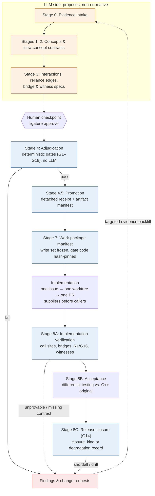

# ligature

`ligature` is a CLI for porting a codebase to Rust with LLM help, without
letting the LLM decide whether its own work is correct.

LLMs draft the specifications: evidence, concepts, contracts, and the
**reliance graph**, which records what each component relies on from each
other component. Deterministic gates then check those drafts, a human
approves them, and a hash-pinned work-package manifest freezes the write set
so that implementation work cannot quietly weaken a spec. A verification
shortfall becomes a change request and goes back into the loop. Nothing
downstream patches around it.

> **Scope:** ligature has only been tested on **C++ → Rust** ports. The
> approach (reliance graphs, a determinism boundary between LLM proposals and
> mechanical gates, human promotion checkpoints, change-request feedback)
> doesn't depend on either language and could be extended to other
> source/target pairs. This repository **does not support** other languages.

## Workflow



Everything below the human checkpoint is deterministic. No gate ever calls an
LLM, because a gate that could ask an LLM "does this look right?" would let the
LLM's own proposals certify themselves. The feedback edges carry the loop:
gate failures, unprovable obligations, and closure shortfalls all become
change requests that re-enter at Stage 0 with targeted evidence.

Stages 5 (stub emission) and 6 (attach gate) are designed but not yet
implemented. They're left out of the diagram above.

## Quick start

ligature ships as a single Python zipapp, `ligature.pyz`. You copy it into
your own port workspace and run it there. Requires Python ≥ 3.10 with
`jsonschema` and `PyYAML` installed.

1. Get `ligature.pyz`. Either copy the published build from
   [`releases/v1.0/`](releases/v1.0/) (check it with
   `sha256sum -c SHA256SUMS`; `PROVENANCE.json` records the exact source
   commit), or build it yourself from this checkout:

   ```sh
   pip install -r requirements.txt
   python3 scripts/build_zipapp.py --out dist   # writes dist/ligature.pyz
   ```

2. Bootstrap your workspace and follow `check`'s next action:

   ```sh
   cd <your-port-workspace>
   python3 ligature.pyz init --mode port
   python3 ligature.pyz check        # read-only status + next action
   ```

`init` writes a `project-descriptor.json` with placeholder values such as
`<path-to-cpp-source-repository>`. Replace them with your own paths and
settings. ligature never assumes any machine-specific location. The LLM
backend is also set there and is pluggable (`claude -p`, `codex exec`,
`opencode run`, or a manual mode).

## Further reading

- [`docs/mode-p-cli-flow.md`](docs/mode-p-cli-flow.md): every CLI command mapped to its stage
- [`docs/cli-contract.md`](docs/cli-contract.md): command grammar and semantics
- [`docs/trust-and-compatibility-boundaries.md`](docs/trust-and-compatibility-boundaries.md): read/write authority
- [`plan.md`](plan.md): full design rationale
- `vendor/concept-to-code`: the concept/contract skill that covers layers 1–2 (git submodule)

## License

MIT, see [`LICENSE`](LICENSE). The `vendor/concept-to-code` submodule is a separate repository with its own terms.
