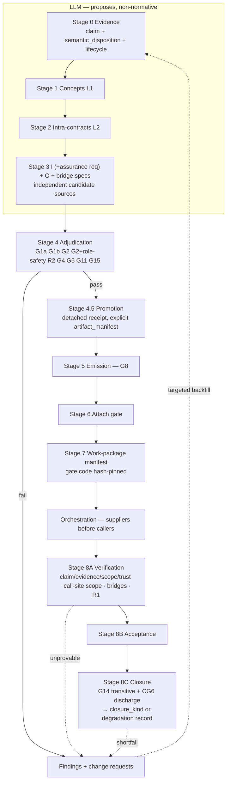

# Reliance-Graph Pipeline: Plan v5

## Claim block

- **Reliance architecture** — settled. S / I / C / O separation needs no further redesign.
- **Assurance semantics** — open design; the *mechanism* is closable with no tooling gap; **profile authorship is standing human governance**, versioned and owned like `reliance-policy.md`.
- **Bridge semantics** — closable **within** a verifier system (bounded for Kani, deductive for Creusot/Verus); **capability-gapped across** systems, ceiling `harness-tested`.
- **G14 SCC closure** — engineering **plus an explicit non-circularity / induction discharge**. The reachability is free; the cycle rule is not.
- **Closure** — a **per-cluster property with a kind** (`deductive` | `bounded`) under a declared profile. Degraded clusters carry a degradation record. **Never a global pipeline guarantee.**
- **Feature witnesses (§16)** — a deterministic ∃-witness layer for layer-2 pure queries: evidence, never assurance, never in `accepted_evidence_kinds`, **no effect on `closure_kind`**. Independent of the I/O/bridge/closure track; gated on the project descriptor only.

**The value does not depend on closure.** It comes from the manifest freezing the write set, forbidding spec-weakening, and routing every shortfall to a change request. That is realizable at **Prototype A + the work-package manifest**, before any bridge or closure work.

| Track | Ready? | Blocking |
|---|---|---|
| Prototype A — G2+ **role safety only** | **yes**, after §2 | filenames, G1a/G1b split, reliance-policy doc, A006 as expected migration failure |
| Work-package manifest (write-set freeze + change-request routing) | **yes**, after §10 | gate-implementation hashing, valid-YAML examples |
| I-schema | **close** | detached receipt with explicit artifact manifest, computed eligibility, assurance requirement located in I, realization/config scope, protocol classification, evidence lifecycle |
| Bridge implementation | **within-verifier only** | call-site fact semantics, typed bridge expression language |
| Cross-verifier bridges | **capability-gapped** | no soundness theorem exists; `harness-tested` ceiling |
| Release closure (G14) | **conceptually sound** | transitive closure + SCC well-foundedness discharge |
| Feature witnesses (§16) | **yes**, after project descriptor | renderer canonical-numeric-result build-out (§16.1) — confirmed not yet built |

---

## 0. Changes from v4

| v4 | Verdict | v5 |
|---|---|---|
| "No further foundational redesign required" | **Overstated** | Reliance architecture settled; **bridge and assurance semantics remain open design work**. |
| G2+ checks "declared assurance target" at Stage 4 | **No artifact to validate** (§1) | Boundary v1.0 has no assurance field; the manifest is generated at Stage 7, after promotion. **Assurance requirement moves into I.** Prototype A G2+ = **role safety only**. |
| `established_by: [Scheduler.C004]` | **Temporal error** (§2) | A caller *postcondition* holds after the caller returns; the call happens inside. Replaced with **call-site fact semantics**: available contract facts, required local facts, target expression. |
| `accepted_kinds: [bounded-model-check, bridge-checked]` | **Mixes categories** (§3) | Split into independent fields: **claim / evidence-method / result / scope / trust / support**. |
| Promotion hashes "evidence trace relations" | **Incomplete** (§4) | Explicit `artifact_manifest` of paths + hashes, including **evidence records**, conflict resolutions, exemptions, protocol debt, policy docs, schema versions. No implicit globs. |
| Protected write set covers specs, Cargo, CI | **Gates unprotected** (§5) | **Gate implementations, schemas, policy files, harness generators, verifier config, and command registries are hash-pinned.** G13 validates before running any gate. |
| `promotion_id` inside exemptions and conflict records | **Forward reference** (§6) | One-way: normative artifacts carry `review` blocks; the receipt lists them; only generated reports cite `promotion_id`. |
| G14 checks each direct relation | **Misses depth** (§7) | **Transitive closure** over required-guarantee dependencies, cycle detection, trust policy applied across the whole closure, **plus an SCC well-foundedness discharge**. |
| `<boundary_id>::<tracking_issue>` | **OK for MVP** (§8) | Keep, **add `assumption_hash` now**. Registry before broad orchestrator use. |
| 5 dispositions | **Conflates axes** (§9) | Split `semantic_disposition` (required/incidental/bug-compat/unspecified) from `lifecycle` (accepted/aspirational/deferred/rejected/out-of-scope). |
| G16 `unresolved > 0 → block` | **Kills dynamic-dispatch clusters** (§10) | **Risk-based**: critical/high → block; medium → human decision; low → visible accepted limitation. Never a full-coverage claim either way. |
| "topological order" | **Ambiguous** (§11) | O edges point **caller → supplier**; scheduling uses **reverse dependency order** (suppliers first) unless modular assumptions permit parallel work. Record the rule. |
| `- id: build ; runner: cargo ; args: [...]` | **Not valid YAML** (§12) | Block-form YAML. **Canonical examples must pass their schema in CI.** No wildcard harness names. |
| Closure as one bit | **Loses the ceiling** | `closure_kind ∈ {deductive, bounded}`. A Kani-owned cluster satisfies the profile while delivering only bounded assurance. |
| "Kani generic callee has no reachable assurance" | **Over-stated** | **Per-instantiation, not type-universal.** ∀-over-inputs holds; ∀-over-type-parameters does not. |
| "concurrent clusters can never exceed `assumed`" | **Over-stated** | True for Kani and Creusot; **Verus has tracked/ghost-permission concurrency.** Ceiling is verifier- and property-class-specific. |

---

## 1. Thesis

The skill covers layer 1 (concepts) and layer 2 (intra-concept contracts). Architecture lives in layer 3 — **client–supplier reliance edges**.

> **The reliance graph is the semantic-dependency view of architecture. It records what each client relies on from each supplier. Deterministic checks validate its structure and traceability. Verifiers, bridge checks, tests, and human promotion determine which obligations are *established* — and at what closure kind.**

Cross-concept reliance is one major source of contract gaps; the reliance graph makes that class explicit. Local failures — frame conditions, overflow, hidden-state mutation, partial functions, panic paths, nontermination, aliasing — remain layer-2 and Stage-8A concerns.

### 1.1 Project structure descriptor (Stage P0)

The pipeline's one external input, and the concrete answer to "project structure as an input": one per project workspace, read by every later stage instead of any stage hardcoding project shape.

```
schemas/project-descriptor.schema.json   ← normative schema, draft-2020-12
schemas/examples/*.example.json          ← canonical examples, checked against the schema in CI
```

```json
{
  "schema_version": "1.0",
  "project": { "name": "example-greenfield", "crate_naming_convention": "^example-greenfield-[a-z]+" },
  "mode": "greenfield",
  "crates": [
    { "crate_dir": "crates/example-greenfield-core", "contracts_crate": "contracts", "specs_search_root": "crates" }
  ],
  "verifier_policy": { "default": "creusot", "scheduling": "kani" },
  "compatibility_policy": { "reliance_policy_path": "docs/reliance-policy.md" },
  "write_set": { "allowed_roots": ["crates/*/src/"], "protected_roots": ["crates/*/specs/**"] },
  "gate_integrity": [{ "path": "scripts/closure_gate.py" }],
  "llm_backend": { "kind": "claude", "command": "claude -p" },
  "review": { "reviewer": "<human>", "reviewed_at": "2026-08-2x" }
}
```

Fields, and why each exists:

- **`project`** — name and this project's own crate-naming convention. Never hardcoded by the pipeline itself (an earlier draft baked in a `^beast-rs-[a-z]+`-shaped regex; that was a modeling error, not a design requirement — see `docs/concept-to-code-modifications.md` gap #4).
- **`mode`** — `greenfield` (Mode R, §11) or `port` (Mode P, §11, a foreign-language source port validated by differential testing). `mode: port` requires `port_source` (repository, origin language, oracle build command) — enforced by the schema's `if`/`then`, not left to convention. Origin-language provenance is recorded here, one layer above concept-to-code, never inside a concept spec (`docs/concept-to-code-modifications.md` gap #3).
- **`crates[]`** — the concept-to-code binding per crate (`crate_dir` / `contracts_crate` / `specs_search_root`), replacing ad hoc CLI flags re-derived on every invocation (`docs/concept-to-code-modifications.md` gap #1).
- **`verifier_policy`** — default verifier plus per-cluster overrides, feeding `closure_kind` (§4) and CG1 cross-verifier detection directly from `crates[].verifier` values concept-to-code already exposes.
- **`compatibility_policy`** — where the governed policy docs live (`reliance-policy.md`, and `witness-policy.md` if §16 is in use).
- **`write_set`** — default `allowed_roots` / `protected_roots` (§10); a starting point each work package narrows, never widens.
- **`gate_integrity`** — gate-implementation paths to hash-pin; G13 validates every one before any gate runs (§10, §12).
- **`llm_backend`** — §6.1's pluggable one-shot backend selection (`claude` / `codex` / `opencode` / `manual`) for stages 0, 3, and findings-driven re-entry.
- **`review`** — same discipline as every other normative artifact in this plan: a human reviewer and date, required, `additionalProperties: false` throughout.

---

## 2. Local ground truth — fix before Prototype A

```
crates/*/specs/_boundaries/<caller_concept>_<caller_method>__to__<callee_concept>_<callee_method>.json
```

- **Flat files.** An earlier tool this rule is inherited from used `glob("*.json")` — no recursion, so nested layouts were silently ignored rather than rejected. `scripts/validate_boundary_naming.py` (chainlink #8) fixes this the other way: it scans recursively and treats anything not directly inside a `_boundaries/` directory as a hard violation, so a nested file surfaces instead of vanishing.
- **Doubled underscores on both sides of `to`.** Single underscores will not match.
- **`boundary_id` == filename stem**, exactly.
- Validate any generator against a live artifact byte-for-byte. Do not re-derive the rule.

`scripts/validate_boundary_contracts.py` implements the full G1a/G1b/G2+ chain against `docs/boundary-contract-schema.json` (chainlink #9/#11); fixtures and the deliberate-failure regression case (chainlink #12) live under `tests/fixtures/boundary_contracts/`.

concept-to-code's current concept schema `$defs` (6, checked directly against `vendor/concept-to-code/schemas/spec.schema.json`): `kani_f64_check`, `query`, `command`, `constraint`, `adversary_case`, `source_reference`. **Neither `command` nor `constraint` carries a stable id** — `query`/`command` have a de facto one via the function name embedded in `rust_sig`, but `constraint` has nothing beyond `english` text and array position, which the whole obligation-reference scheme (`callee_guarantees: [TaskQueue.C003]`, work-package `obligations`, `reliances[].obligation_id`) depends on. See `docs/concept-to-code-modifications.md` gap #6 — decided: add `id: string` to `constraint` upstream, not yet applied. The PascalCase→snake_case conversion this pipeline's own tooling needs (for filename↔body cross-checks) is copied verbatim from `vendor/concept-to-code/emit_stubs.py`'s `snake_case()` — an external review after #37 landed (2026-08-26) found the first version re-derived it via regex instead and broke on acronym concepts (`HTTPClient` → `h_t_t_p_client`), which this plan's own §2 already warned against ("copy the rule, do not re-derive it"). Crate naming is never hardcoded by the pipeline; it's a per-project declaration in the project structure descriptor (§1.1). Every canonical example is copied from a passing live artifact and generalized — hand-written examples are untrustworthy against `additionalProperties: false`.

**Semantic policy** (`docs/reliance-policy.md`), resolving the schema-prose vs. G2+ conflict:

```
callee PRECONDITION                        → bridge specification
callee POSTCONDITION / INVARIANT relied on → callee_guarantees
adversary case (A*)                        → evidence / test seed, never a guarantee
```

The live `PartitionedTreeLikelihood.A006` inside `callee_guarantees` is an **expected G2+ failure** and the first regression fixture.

**Prototype A scope: G2+ is role safety only.** The declared-assurance-target check is removed until §3.1 lands.

---

## 3. Capability-gap register

The honest boundary of what this pipeline can achieve in 2026. Verifier population in the repo: **Creusot 53, Kani 23, Verus 23**.

| ID | Gap | Nature | Ceiling | Response |
|---|---|---|---|---|
| **CG1** | **Cross-verifier composition has no soundness theorem.** Kani (CBMC bounded), Creusot (Why3/SMT deductive), Verus (SMT + ghost) differ in memory model, numeric abstraction, panic/termination semantics, trusted-assumption sets. | permanent, tooling | `harness-tested` | degradation record + tracking issue |
| **CG2** | **Call-graph completeness is undecidable** — dynamic dispatch, fn pointers, closures, FFI. | permanent, theoretical | honest `unresolved` classes | report, never claim closure |
| **CG3** | **Generics under Kani** verify per monomorphization: ∀-over-inputs holds, **∀-over-type-parameters does not**. | tooling | per-instantiation | **placement rule**: assign generic callees to Creusot when type-universality matters |
| **CG4** | **Concurrency** — no coverage in Kani or Creusot. **Verus has tracked/ghost-permission concurrency.** | verifier-specific | `assumed` for Kani/Creusot; **can exceed for Verus** | property-class-specific ceiling, never a blanket rule |
| **CG5** | **Non-falsifiable assumptions** — wait-freedom, complexity bounds, harness completeness. | permanent | `human-risk-acceptance` | typed mitigation, risk-tiered |
| **CG6** | **Circular assume-guarantee is not automatically sound.** If A's proof assumes B and B's assumes A, the pair can be mutually satisfied yet model-inconsistent without a well-foundedness argument — step index, decreasing measure, or temporal stratification. | semantic obligation | requires explicit discharge | SCC closure needs a stated discharge rule (§8.5) |

**CG1 is already latent beyond the two hand-authored boundaries.** The analysis-configuration cluster contains Creusot↔Kani intra-cluster structural edges. Cross-verifier reliance is a property of the current decomposition, not a two-edge special case — the `harness-tested` ceiling and degradation record will fire more often than a two-edge estimate implies.

**Not a capability gap:** `satisfies()` *mechanism* is engineering. But **which** achieved assurance is sufficient for **which** obligation — e.g. accepting Kani bounded at `unwind: 8`, `queue_len_le_8` for a release obligation — is an irreducible risk decision. Profile authorship is versioned, owned human governance. It closes, but never stops needing a human.

---

## 4. Closure profile

A **per-cluster** declared property, with a kind.

```yaml
# specs/_closure/mcmc-chain.yaml
cluster: mcmc-chain
closure_kind: deductive        # deductive | bounded
conditions:
  single_verifier_system: true
  owning_verifier: creusot
  protocol_class_all_pairwise: true
  unresolved_indirect_calls_at_or_above_medium: 0
  generic_callees_type_universal_or_creusot_owned: true
  transitive_assumptions_within_policy: true
  scc_wellfoundedness_discharged: true    # CG6; n/a if acyclic
review:
  reviewer: <human>
  reviewed_at: 2026-08-2x
```

| Owning verifier | `closure_kind` | Meaning |
|---|---|---|
| Creusot / Verus | **deductive** | universal over inputs, modulo SMT completeness and trusted specs |
| Kani | **bounded** | holds only within unwind/harness bounds and enumerated monomorphizations |

Two clusters with identical profile bits carry different guarantees; `closure_kind` is what prevents a Kani-owned cluster from silently reading as full closure.

**Degradation record** — a declared state, not a failure, on the same footing as protocol debt:

```yaml
# specs/_closure/analysis-configuration.degradation.yaml
cluster: analysis-configuration
failed_conditions:
  - single_verifier_system
affected_edges:
  - <boundary_id of the Creusot→Kani edge>
ceiling: harness-tested
tracking_issue: chainlink:...
review:
  reviewer: <human>
  reviewed_at: 2026-08-2x
```

---

## 5. Four graphs

| Graph | Meaning | Source | Normative? |
|---|---|---|---|
| **S** | declaration / type dependency | `gen_concept_graph.py` | **no** — candidate suggestion only |
| **I** | **intended** method interaction **+ assurance requirement** | `docs/interaction-schema.json` | yes, after promotion |
| **C** | **realized** call relation — `C_static` / `C_dynamic` | config-pinned extractors | observed, configuration-relative |
| **O** | contractual reliance | `_boundaries/*.json` v1.0 | yes, after promotion |

- **R2 (pre-impl):** every *eligible* I edge covered by an O artifact or a reviewed exemption.
- **R1 (post-impl):** C reconciled with I — eligible calls, compatible configurations, risk-tiered on extraction confidence.
- **S:** proposes candidate I edges only.

R2 proves coverage **relative to accepted I**; it does not prove I complete. Since Stage 3 generates both I and O, independent candidate sources are mandatory: Mode P source call extraction, tests and runtime traces, S candidates, data-flow analysis, requirements, a separate critic pass, human promotion.

### 5.1 Interaction schema (I) — now carries the assurance requirement

```yaml
# docs/interaction-schema.json → specs/_interactions/*.json
interaction_id: I-SCHED-TQ-001
caller:
  concept: Scheduler
  method: dispatch
callee:
  concept: TaskQueue
  method: pop_ready
edge_class:
  - stateful
  - cross-verifier
eligibility: boundary-required      # COMPUTED from edge_class; stored must match (G1b)
rationale: "dispatch's postcondition depends on pop_ready's return discipline"
evidence_links:
  - E-0143
protocol_class: pairwise
realization:
  requirement: required             # required|optional|feature-gated|platform-gated|test-only|fallback-only
  config_scope:
    target: x86_64-unknown-linux-gnu
    features: [default]
    cfg: []
reliances:                          # §3.1 of review, Option A
  - obligation_id: TaskQueue.C003
    required_assurance:
      required_claims:
        - postcondition-holds
      accepted_evidence_kinds:
        - creusot-deductive-check
      minimum_scope:
        input_domain: queue_len_le_8
        feature_set: default
      trust_policy:
        assumptions_allowed: []
review:
  reviewer: <human>
  reviewed_at: 2026-08-2x
# NO promotion_id here — one-way references (§7.1)
```

### 5.2 Eligibility is computed

```
cross-verifier | cross-crate-public-api | stateful | error-panic-boundary
  | ownership-transfer | numeric-domain-boundary   → boundary-required
pure-data-type-reference | import-only             → inform
marker-type | phantom-type                         → ignore
```

G1b recomputes and rejects disagreement. A proposing model cannot mark a stateful cross-verifier edge `ignore`. Exemptions are separate reviewed objects carrying a `review` block (not a `promotion_id`).

Implemented in `docs/interaction-schema.json` (G1a; chainlink #16 scope only — `interaction_id`, `caller`/`callee`, `edge_class`, `eligibility`, `rationale`, `evidence_links`, `review`; deliberately without `reliances[].required_assurance` (#17), `realization`/`config_scope` (#18), or `protocol_class` (#19), which extend this same schema when their milestones land) and `scripts/validate_interaction.py`: `compute_eligibility()` implements the table above exactly (boundary-required wins over inform, which wins over ignore, when an edge carries more than one class — every schema-valid `edge_class` array resolves to exactly one bucket), and G1b rejects disagreement with the stored `eligibility` in *both* directions, not just under-claiming — an edge overstated as `boundary-required` for a `marker-type`-only class is rejected exactly like a stateful cross-verifier edge understated as `ignore`. Filename/layout discipline mirrors boundary contracts: flat inside a `_interactions/` directory, `interaction_id` == filename stem.

Exemptions are implemented in `docs/exemption-schema.json` + `scripts/validate_exemption.py`: a separate object at `crates/*/specs/_exemptions/<interaction_id>.json`, `interaction_id` == filename stem (one exemption per interaction), carrying its own `review` block and never a `promotion_id` (`additionalProperties: false` rejects one outright — references are one-way, §7.1). Chainlink #16 scope is schema + naming (G1a/G1b) only; cross-referencing that the named interaction is real and actually eligible, and that R2's coverage requirement (boundary OR reviewed exemption) is satisfied, is R2's own job (#21), not this validator's. Both validators are wired into `pipeline.py` as `validate-interaction`/`validate-exemption` (Stage 4, descriptor-driven crate iteration like `validate`) and into the `draft`/`approve` dispatcher (`_select_validate_fn`) alongside boundary contracts, so `pipeline.py approve` gates all three artifact types through the same reviewed-checkpoint mechanism.

A further external review (2026-09-01) found two residual gaps, both reproduced directly before being fixed: (1) high — neither `check_naming` checked the file suffix, so a schema-valid interaction or exemption saved as `*.yaml` matched G1b's other checks with zero findings, and separately, both scan-side `validate()` functions silently `continue`d past any non-`.json` file instead of reporting it, so a malformed or wrong-extension artifact under a real `_interactions`/`_exemptions` directory produced an overall OK — fixed by adding an explicit `.json`-suffix check to `check_naming` (G1b) in both validators, no longer skipping non-`.json` files in the scan loop (so unparseable content now surfaces as a G1a finding instead of vanishing), and adding the same suffix refusal to `pipeline.py`'s `_select_validate_fn` dispatcher up front, before its directory match runs — reproduced end to end through `approve`, which previously wrote a `.yaml`-named artifact straight through with a real validator's blessing; (2) medium — the Stage 4 scan commands (`cmd_validate_interaction`/`cmd_validate_exemption`) searched recursively for any directory named `_interactions`/`_exemptions` anywhere under the crate, not anchored to the crate's declared `specs/_interactions`/`specs/_exemptions` layout, so a schema-valid artifact under `<crate>/not_specs/_interactions/` passed with zero findings — the same class of gap the approve dispatcher was already anchored against (§7.1's `#15` review chain, and the boundary-contract fourth review pass), just not yet applied to these two scan commands. Fixed with a new `validate_dir()` in each validator module that scans only an already-known, exact directory (no `_interactions`/`_exemptions`-anywhere search), called by `pipeline.py` with `project_descriptor.interaction_dir_for()`/`exemption_dir_for()`'s result; the standalone CLIs' own recursive `validate()` is deliberately left unanchored (mirrors the boundary-contract standalone CLI, which has no crate-descriptor concept to anchor to) but now reports rather than skips non-`.json` files. A crate with no interactions/exemptions declared yet is not an error (`validate_dir` returns `[]` for a missing canonical directory); only a missing *crate* root is a config mistake worth failing loud on.

A THIRD review pass (2026-09-01) found the medium-severity fix above was itself wrong: anchoring the scan to *only* the canonical directory stopped a mislocated artifact from being wrongly validated, but it also stopped that artifact from being examined at all — a crate with no `specs/_interactions` and a fully schema-valid artifact under `<crate>/not_specs/_interactions/` still reported OK, reproducing the exact zero-findings outcome the original review objected to, just by omission instead of false acceptance; reproduced directly with otherwise-valid fixture content before fixing. `validate_dir()` is replaced by `validate_crate(crate_root, canonical_dir)` in both validator modules: it discovers candidates crate-wide (the same recursive `find_interaction_files`/`find_exemption_files` discovery the standalone CLI already used), then rejects — with an explicit G1b finding naming the expected and actual directory — any candidate whose resolved parent isn't exactly `canonical_dir`, regardless of whether the artifact's own content would otherwise be schema-valid. `pipeline.py`'s `cmd_validate_interaction`/`cmd_validate_exemption` now call `validate_crate(crate_root, interaction_dir_for(...))` instead. Regression fixtures assert this end to end: a fully valid artifact placed under `not_specs/_interactions/` (or `_exemptions/`) now fails with exit code 1, proving location alone causes rejection, not merely that a differently-broken payload happens to fail for an unrelated reason.

`reliances[].required_assurance` (chainlink #17) extends `docs/interaction-schema.json` with the worked example above field-for-field. §8.1's type split is enforced structurally, not by custom code: `required_claims` and `accepted_evidence_kinds` are two disjoint JSON Schema enums (claim values only in one, verification-method values only in the other), so a `bridge-checked`/`bounded-model-check`-style value can never land in the wrong field — the schema itself makes the mixing this section warns against impossible to write, in either direction. `minimum_scope` is deliberately left open (`additionalProperties: {"type": "string"}`, mirroring `promotion-receipt-schema.json`'s `schema_versions`) since its vocabulary is verifier-specific; `trust_policy` is closed, matching the worked example's single `assumptions_allowed` field exactly. `reliances` itself is optional at the schema level — an `inform`/`ignore`-eligible edge has nothing to declare a reliance on, so it's never forced into an empty array. `scripts/validate_interaction.py` adds one new G1b semantic check, `check_reliance_obligation_uniqueness`: two reliance entries for the same `obligation_id` within one interaction are rejected (mirrors `validate_boundary_contracts.py`'s tracking-issue-uniqueness check) — otherwise there would be no way to tell which of two conflicting `required_assurance` blocks governs. Cross-referencing that a declared `obligation_id` actually names a real obligation on the callee (the same kind of resolution boundary contracts' G2+ already does for `callee_guarantees`) is deliberately out of scope here, for the same reason #16 deferred it — a future gate's job, not this schema's.

An external review (2026-09-01) found this initial delivery left **G2++** unimplemented — the gate table's own row (§12: "Declared assurance requirement present in I *(after §5.1 lands, not Prototype A)*") that chainlink #11 explicitly deferred until #17 landed. `reliances` being schema-optional with no `minItems` meant a `boundary-required` interaction with `reliances` omitted, or `reliances: []`, passed with zero findings — reproduced directly before fixing. This is not R2's job (#21): R2 checks whether an *eligible* interaction is *covered* by a boundary artifact or reviewed exemption; G2++ checks, independently, whether the interaction *declares* an assurance requirement at all — a `boundary-required` edge with no boundary contract yet **and** no declared reliance would otherwise be invisible to both checks. Fixed with `check_g2_plus_plus` in `scripts/validate_interaction.py`: any interaction with stored `eligibility == "boundary-required"` must have a non-empty `reliances`; `inform`/`ignore` edges remain exempt, since `reliances` is optional precisely for their case. An empty array is treated identically to an omitted field — both declare nothing. Independently reproduced via raw script calls confirming both the omitted-field and empty-array cases are now rejected, and that `inform`/`ignore` edges remain unaffected either way.

`realization.requirement` + `config_scope` (chainlink #18) extends `docs/interaction-schema.json` with the worked example's `realization` block: `requirement` is a closed enum of the six documented values (`required`/`optional`/`feature-gated`/`platform-gated`/`test-only`/`fallback-only`); `config_scope` requires `target`/`features`/`cfg` all present, matching the worked example field-for-field. Unlike `reliances` (§17, conditionally optional via G2++), `realization` is **required on every interaction regardless of eligibility** — the issue text is "each interaction edge declares," not conditioned on `boundary-required`, so an `inform`/`ignore` edge must declare it too. `target` is checked against a loose target-triple shape (2–4 lowercase hyphen-separated segments) rather than an exhaustive enumeration of real Rust targets, which changes over time and isn't the kind of fixed vocabulary a schema enum suits. `features` and `cfg` carry no `minItems`, unlike `edge_class`/`required_claims` — an edge can legitimately be gated by nothing (always compiled, no extra `cfg` predicate), matching the worked example's own `cfg: []`. No new G1b/G2-style semantic check was added for `realization` itself: unlike `eligibility` (derived from `edge_class` by a documented formula) or `reliances` (gated by G2++, a documented table row), plan.md states no derivable or cross-field rule for `requirement`/`config_scope` to check against, so none was invented.

An external review (2026-09-01) found the `target` pattern itself was wrong: `^[a-z0-9_]+(-[a-z0-9_]+){1,3}$` rejected real Rust target triples that use a dot within a segment, e.g. `thumbv8m.main-none-eabi` and `thumbv8m.base-none-eabi` (Cortex-M33/M23, with/without the Main/Base architecture profile) — reproduced directly before fixing. Fixed by allowing `.` inside each segment's character class: `^[a-z0-9_.]+(-[a-z0-9_.]+){1,3}$`. Both dotted targets, and the existing garbage/no-hyphen negative cases, were independently re-verified via raw script calls after the fix.

A second pass (2026-09-01) found that fix was itself too loose: `[a-z0-9_.]+` allows a dot anywhere, including a leading dot (`.-none-eabi`), a trailing one (`thumbv8m.-none-eabi`), consecutive dots (`thumbv8m..main-none-eabi`), a dot immediately before a hyphen (`thumbv8m.main.-none-eabi`), or a segment that's nothing but a dot (`foo-.-bar`) — all five reproduced as accepted before fixing. Fixed by requiring dots to sit strictly between non-empty components: `^[a-z0-9_]+(?:\.[a-z0-9_]+)*(?:-[a-z0-9_]+(?:\.[a-z0-9_]+)*){1,3}$` — each hyphen-separated segment is itself a non-empty, dot-joined sequence of non-empty sub-components, so a dot can never be adjacent to a hyphen, another dot, or a string boundary. Verified against all 320 built-in `rustc --print target-list` targets (all match), both `thumbv8m.*` targets, all five malformed-dot cases (all rejected), and the pre-existing `garbage`/`not_a_target_triple` negatives (still rejected) — independently, via raw script calls, before signing off.

### 5.3 Protocol classification — fail closed

Non-pairwise classes require a protocol artifact or a protocol-debt record. An out-of-scope declaration suffices only when **all five** hold: no promoted obligation depends on the protocol; no work package touches its path; no release claim includes it; a human signed the scope cut; a tracking issue records the missing support. A normal boundary exemption is never sufficient for a temporal obligation.

Implemented (chainlink #19): `protocol_class` is added to `docs/interaction-schema.json` as a required, closed two-value enum (`pairwise`/`non-pairwise`) — required on every interaction like `realization` (§18), since "non-pairwise classes require..." presupposes every interaction always has a classification to check. A "protocol artifact" itself is deliberately not built here: plan.md gives it no worked example or shape anywhere (unlike every other artifact type this session has delivered), and it most plausibly refers to the not-yet-built bridge spec (§8.2, `specs/_bridges/*.yaml`, which already carries its own `protocol_class: pairwise` field) — future M4/M6 work, out of scope for #19.

The protocol-debt record IS fully specified in prose and is built as its own artifact type: `docs/protocol-debt-schema.json` + `scripts/validate_protocol_debt.py`, one per `crates/*/specs/_protocol_debt/<interaction_id>.json`, `interaction_id` == filename stem (mirrors `docs/exemption-schema.json`'s discipline exactly — same naming/layout, same G1a/G1b/`validate_crate` shape — but a distinct artifact type, since "a normal boundary exemption is never sufficient for a temporal obligation"). Of the "all five" conditions: the two that are checkable from the record's own fields are directly enforced (`tracking_issue`, non-empty; `review`, required); the three that are facts about promoted/external state (no promoted obligation depends on it, no work package touches its path, no release claim includes it) cannot be mechanically re-verified by a standalone schema — they are represented as `const: true` attestation fields instead, so a record can never be filed admitting one is false, even though the schema can't independently confirm it's true. This is the same cross-referencing boundary #16 drew for R2/exemptions, applied here to G15.

G15 itself (does a non-pairwise interaction actually have a corresponding protocol artifact or protocol-debt record) is a cross-file coverage check, structurally identical to R2's own.

An external review (2026-09-01) found this deferral was wrong: #21 is only the I-schema milestone gate ("all of #15-#20 landed"), not an issue that itself implements gates — #19's own title says "fail closed," so G15 belongs to #19, not to whatever eventually implements R2. The review reproduced a non-pairwise interaction with zero coverage artifacts passing with zero findings, plus two gaps in the debt-record validator itself: a debt record naming a nonexistent interaction, and one filed for what is actually a *pairwise* interaction, both also passed with zero findings. All three reproduced directly before being fixed.

**G15 is now implemented**, fail-closed, in `scripts/validate_interaction.py` (`check_g15_protocol_coverage`) and `scripts/validate_protocol_debt.py` (`check_interaction_cross_reference`, labeled `G2` — a dangling-reference check, mirroring boundary contracts' own `G2`). Since a "protocol artifact" has no schema, the only checkable coverage mechanism today is a *valid* protocol-debt record naming the interaction — "valid" meaning it itself passes G1a/G1b and its own `G2` cross-reference (real interaction, actually `non-pairwise`). `pipeline.py`'s `cmd_validate_interaction`/`cmd_validate_protocol_debt` and the `approve` dispatcher all wire the two validator modules together via `project_descriptor`-style composition at the orchestration layer — neither validator module imports the other, avoiding a circular import, the same reason `project_descriptor.py` itself exists. Both cross-reference checks accept an optional lookup defaulting to `None`; `None` degrades to a visible **info**-severity note ("not checked in this context"), never a silent pass, for the single-directory standalone CLIs, which have no sibling directory to consult — the crate-aware `validate_crate()` used by `pipeline.py` always supplies a real lookup, making it genuinely fail-closed there. `main()` in both standalone scripts was updated to filter by severity (mirroring `validate_boundary_contracts.py`'s own established info/error split) — before this fix, an info-severity finding was incorrectly counted as failure.

A further finding (medium) questioned the three externally-facing attestation fields (`no_promoted_obligation_depends_on_protocol`, `no_work_package_touches_its_path`, `no_release_claim_includes_it`): `const: true` prevents recording `false`, but doesn't establish the conditions actually hold, and offered a choice — mechanically verify what's checkable and block on what isn't, or explicitly declare attestation authoritative. Given no artifact in this codebase captures *which code path a protocol covers* (a prerequisite for checking "no work package touches its path" at all), and given "release claim" has no schema yet, partially mechanizing just one of the three would imply more rigor than actually exists. `docs/protocol-debt-schema.json`'s description now states this explicitly as a normative authority model, not a silent gap: a human reviewer's signed attestation is authoritative for all three, exactly as plan.md §7.2 already establishes review as the terminal authority for every other checkpoint in this system (boundary contracts, exemptions, promotions — none of those are mechanically re-derived by their validators either).

---

## 6. Scope of the workflow

```
┌────────────────────────────────────────────────────────────────────────────────┐
│                     LLM SIDE — proposes, NON-NORMATIVE                         │
│  Stage 0  EVIDENCE INTAKE  → claim + origin + semantic_disposition + lifecycle │
│  Stage 1  CONCEPTS     L1                                                      │
│  Stage 2  INTRA-CONTRACTS L2                                                   │
│  Stage 3  INTERACTION (I, incl. assurance requirement) + RELIANCE (O)          │
│           + BRIDGE SPECS (call-site fact semantics)                            │
│           + independent candidate sources                                      │
└──────────────────────────────┬─────────────────────────────────────────────────┘
════════════════════════════ DETERMINISM BOUNDARY (≠ AUTHORITY) ═════════════════
                               ▼
│  Stage 4    ADJUDICATION                                                       │
│             G1a JSON Schema · G1b repo semantics + COMPUTED eligibility        │
│             G2 ref-integrity · G2+ ROLE SAFETY · R2 I↔O                        │
│             G4 evidence · G5 grounding · G11 unresolved conflicts · G15 protocol│
                               ▼
│  Stage 4.5  PROMOTION → detached receipt w/ EXPLICIT artifact_manifest          │
                               ▼
│  Stage 5    EMISSION      emit_stubs.py · G8 emitter fidelity · NO injection    │
│  Stage 6    ATTACH GATE   attachment dimension only                             │
│  Stage 7    WORK-PACKAGE MANIFEST  read-only · hash-pinned incl. GATE CODE      │
                               ▼
             ORCHESTRATION  (one issue → one owner → one worktree → one PR)
             scheduling: REVERSE dependency order — suppliers before callers
                               ▼
│  Stage 8A   IMPLEMENTATION VERIFICATION                                         │
│             per-obligation claim/evidence/scope/trust records ·                 │
│             scoped call-site coverage · bridge checks · R1 (risk-tiered)        │
│  Stage 8B   ACCEPTANCE (non-normative)  P: differential · R: G10R               │
│  Stage 8C   RELEASE CLOSURE  G14 satisfies() over TRANSITIVE closure            │
│             + SCC well-foundedness discharge (CG6)                              │
│             → closure profile w/ closure_kind, or degradation record            │
        │                         │                          │
        └── change requests ──────┴── drift findings ─────────┘
                    ▲                                         │
                    └──── targeted evidence backfill ─────────┘
```



### 6.1 One CLI, pluggable LLM backend, human checkpoints from §7.2

The diagram's two halves are not two separately-invoked tools. **One CLI spans the whole pipeline**, stages 0 through 8C, reading the project structure descriptor for all configuration. The determinism boundary is enforced in *how* it drives each half, not in *who* invokes it. Implemented in `scripts/pipeline.py` (chainlink #37) — `draft` (Stage 0/3, dispatches the configured `llm_backend`), `approve` (the checkpoint from below), `validate` (Stage 4 G1a/G1b/G2+, fully deterministic) are real today; `pipeline status` reports the rest (promotion, emission, manifest, Stage 8A–8C) as not yet implemented rather than silently no-op'ing, since their schemas don't exist until M3/M4 land:

- **LLM-side stages (0 evidence intake, 3 interaction/reliance/bridge drafting, and any findings-driven re-entry into Stage 0)** — the CLI invokes a configurable **one-shot LLM backend** against a structured-output prompt template: the LLM must emit only the target JSON/YAML matching the relevant schema, nothing else, so the CLI can parse stdout directly with no human transcription step. Backend is pluggable — `claude -p`, `codex exec`, `opencode run`, or a manual mode that prints the constructed prompt and waits for the user to run it themselves and hand back the result. Whichever backend produced it, the output lands in the same place a human-drafted artifact would and is immediately run through G1a/G1b for fast local feedback (cheap syntax/eligibility checks — full Stage 4 adjudication still happens later, unchanged).
- **Every human-authority checkpoint already listed in §7.2** — first cluster acceptance, new concepts, new/weakened contracts, new high/critical assumptions, compatibility-policy changes, evidence-conflict resolution, protocol exemptions, cross-verifier trust decisions, assurance-profile authorship, closure-profile/degradation-record acceptance — is a **pause point**, not a suggestion. The CLI surfaces the proposed artifact (diff against the prior version, or full content if new) and waits for an explicit approval before continuing into Stage 4. An LLM backend may recommend; per §7.2 it is never the sole authority, and this mechanism must not blur that regardless of which backend produced the draft. Only the versioned-policy auto-promote carve-out in §7.2 (mechanical, no semantic text change, no assurance-target decrease, no new assumption, all hashes still bound) skips the pause. Implemented in `scripts/review_checkpoint.py` (chainlink #39): a candidate artifact is staged as `<target>.draft`, never written to its target path directly; `classify()` operationalizes the carve-out as "identical to an *already-approved* prior version except the `review` block itself" — first-time creation is never mechanical, since there is no approved baseline to diff against; `approve()` is the only path that requires an explicit, non-empty reviewer and appends to an audit log (`ci/results/review_log.jsonl`) that survives even if the artifact changes again later. `approve()` also runs the artifact's mechanical gate (a caller-supplied `validate_fn`, e.g. G1a/G1b/G2+ for a boundary contract) *before* writing anything and refuses to promote on any error-severity finding — an external review after #37 landed (2026-08-26) found the first version let a human approve a schema-invalid or role-unsafe draft straight through, which broke this section's own ordering: mechanically-valid → semantically-reviewed → accepted. A second review pass (2026-08-26) found the fix itself was incomplete: `validate_fn` still defaulted to `None`, which silently meant "skip," so any caller that simply forgot to wire one in — including the standalone `review_checkpoint.py approve` CLI, which has no way to know which validator applies to an arbitrary target — still approved with no gate. Fixed by removing the default entirely: `approve()`/`auto_promote_if_mechanical()` now require either a real validator or the explicit `SKIP_VALIDATION` sentinel, and the standalone CLI requires an explicit `--skip-validation` flag to proceed at all (use `pipeline.py approve` instead, which wires in the right validator by the `specs/_<kind>/` directory convention). The same pass also found and fixed: a missing or typo'd scan root produced "OK, 0 findings" indistinguishable from a genuinely clean project (`find_boundary_files` now raises `FileNotFoundError` on a nonexistent root); `review.reviewer`/`reviewed_at` had no `minLength`/format enforcement, so `reviewer: ""` and `reviewed_at: "not-a-date"` both validated (fixed with `minLength: 1`, a defense-in-depth date pattern, and centralizing validator construction in `scripts/schema_utils.py` so `format: date` is actually enforced everywhere, not just where a caller happened to pass a format checker); and `pipeline.py draft`/`approve` accepted a target path verbatim with no check it belonged to the workspace or any declared crate (`_require_target_in_workspace` now refuses both). A third review pass (2026-08-27) found the second pass's fix was still incomplete at a different layer: `pipeline.py`'s own `_select_validate_fn` dispatcher returned `SKIP_VALIDATION` for *any* target it didn't recognize — a boundary artifact placed under a typo'd `specs/_boundary/` (missing the trailing s) matched nothing, silently got `SKIP_VALIDATION`, and was approved with zero gating; reproduced end to end. The `--skip-validation` escape hatch on the standalone `review_checkpoint.py approve` CLI was the same failure one level down — explicit didn't make it safe, it just made an unsafe default opt-in. Fixed by inverting the dispatcher's default: it now raises for anything it doesn't recognize as a known artifact type, rather than falling back to no validation, and the standalone CLI no longer offers `approve` at all (only the read-only `classify`/`diff`) — promotion only ever happens through `pipeline.py approve`, which always resolves a real validator or refuses outright. The audit log also now records `validation: "checked" | "skipped"` per entry, since a skipped approval used to be indistinguishable from a validated one in the record itself, not just in code. A fourth review pass (2026-08-30) found that "recognized" was still too loose even after the third pass's fix: the dispatcher's match condition, `"_boundaries" in target.parts`, matches a `_boundaries` path component *anywhere*, not the crate's actual declared layout — a structurally valid boundary at `crate_a/not_specs/_boundaries/x.json` (wrong parent entirely) and one at `crate_a/specs/nested/_boundaries/x.json` (nested) both matched and promoted successfully; neither is caught by G1b's own "flat" check either, since that only confirms the file sits directly inside *a* directory named `_boundaries`, with no opinion on where that directory sits. Fixed by anchoring the check to the exact expected path — `target.parent` must equal `<crate_dir>/specs/_boundaries` for some declared crate, not merely contain that name somewhere upstream.
- **Stage 4 → Stage 7 (adjudication → promotion → emission → attach → manifest)** run fully deterministically once past that checkpoint — no LLM calls, by construction, for the reason CG1–CG6 exist: a gate that could ask an LLM "does this look right" would make the LLM's own Stage 0–3 proposal self-certifying.
- **Stage 8A → 8C** are the same CLI, invoked again later (post-orchestration, per-PR or at release time) — deterministic verifier dispatch and closure computation, no LLM calls there either.

---

## 7. Promotion

### 7.1 Detached receipt with an explicit manifest

```yaml
# specs/_promotions/mcmc-chain.yaml
promotion_id: PROM-MCMC-001
cluster: mcmc-chain
reviewer: <human>
policy_version: reliance-policy@1.2
schema_versions:
  boundary: 1.0
  interaction: 1.0
accepted_at: 2026-08-2x
artifact_manifest:
  - path: crates/beast-rs-mcmc/specs/mcmc_chain.json
    hash: sha256:...
  - path: crates/beast-rs-mcmc/specs/_interactions/I-MCMC-001.json
    hash: sha256:...
  - path: evidence/E-0143.json
    hash: sha256:...
  - path: specs/_conflicts/EC-004.json
    hash: sha256:...
  - path: docs/reliance-policy.md
    hash: sha256:...
```

The manifest **states the exact set**; no implicit globs. It covers concept specs, interaction specs (incl. assurance requirements), boundary specs, bridge specs, **evidence records**, evidence links, conflict resolutions, exemptions, protocol-debt records, design decisions, compatibility policy, `reliance-policy.md`, and applicable schema/policy versions. The receipt is **not** in its own manifest.

Any listed file changing invalidates the receipt → **acceptance revoked**.

Implemented in `docs/promotion-receipt-schema.json` (G1a, matches the worked example above field-for-field — `reviewer`/`accepted_at` top-level, not nested under a `review:` block, since promotion *is* the human-sign-off event §7.2 describes, not a separate artifact being reviewed) and `scripts/validate_promotion_receipt.py` (chainlink #15), plus `pipeline.py validate-promotion` — standalone, not routed through the draft/approve checkpoint, for the same field-shape reason `approve()`'s nested `review: {}` write can't be reused here, and because receipt *generation* (reading an accepted artifact set and computing the manifest) is separate, not-yet-built work needing the rest of the I-schema machinery, the same boundary already drawn for the work-package manifest's own generator. Every rule above is a real mechanical check, not just schema shape: every `artifact_manifest` path is checked for workspace escape both syntactically (no absolute path, no `..` segment) and after resolution (guards a symlink pointing outside the workspace — verified against a real symlink, not just asserted); every declared hash is recomputed from the real file and compared, with a mismatch reported in exactly the plan's own language ("acceptance is revoked"); the receipt's own path is checked against its own `artifact_manifest` (self-reference is a hard error); and every listed JSON artifact is checked for a `promotion_id` field of its own, since references are one-way. Built with every class of gap the `#14` review chain found already closed from the start, rather than found by review after the fact.

A further external review (2026-08-31) found four residual gaps in the initial delivery, all reproduced directly before being fixed: (1) high — the one-way-reference check only ever inspected `.json` artifacts, so a correctly hashed YAML artifact carrying its own `promotion_id` passed with zero findings, even though §7.1's rule is about an artifact being normative, not which serialization it uses — fixed by loading `.yaml`/`.yml` artifacts the same as `.json` before checking for the field; (2) medium — the receipt itself was never anchored to the workspace or checked against its canonical location, so a receipt copied to an arbitrary path like `/tmp/scheduling.json` validated cleanly against a fixture workspace it wasn't even part of — fixed by resolving the receipt path for workspace containment and requiring it sit directly under `specs/_promotions/`; (3) medium — `artifact_manifest` enforced no set uniqueness, so appending an identical copy of an existing entry produced zero findings — fixed by tracking every entry's *resolved* path (not its string) during validation, catching both literal duplicates and different path strings that alias the same real file; (4) low — the standalone `validate_promotion_receipt.py main()` entrypoint was still untested, since the three CLI integration tests only ever invoked `pipeline.main()` — fixed by adding tests that call `validate_promotion_receipt.main()` directly with real argv.

**References are one-way:** normative artifacts carry `review` blocks and never a `promotion_id`; the receipt lists artifacts; only generated reports cite `promotion_id`.

### 7.2 Authority

Human sign-off required for: first cluster acceptance; new concepts; new or weakened contracts; new high/critical assumptions; compatibility-policy changes; evidence-conflict resolution; protocol exemptions and scope cuts; cross-verifier trust decisions; **assurance-profile authorship**; **closure-profile and degradation-record acceptance**.

Versioned policy may auto-promote only mechanical changes with no semantic text change, no assurance-target decrease, no new assumption, and all hashes still bound. **An LLM critic may recommend; it is never the sole authority.**

---

## 8. Assurance and bridges

> **Normative files declare *required* assurance. CI files record *achieved* assurance.**

### 8.1 Type split — claim / evidence / result / scope / trust / support

`bridge-checked` and `bounded-model-check` are different categories and must never share a field.

| Value | Category |
|---|---|
| `documented` | specification state |
| `tested`, `harness-tested` | evidence method / result |
| `kani-bounded-model-check`, `creusot-deductive-check`, `verus-deductive-check` | verification method |
| `callee-precondition-established`, `postcondition-holds` | claim |
| `assumed` | trust state |
| `unsupported` | support state |

Required:

```yaml
required_assurance:
  required_claims:
    - callee-precondition-established
  accepted_evidence_kinds:
    - kani-bounded-model-check
    - creusot-deductive-check
    - verus-deductive-check
  minimum_scope:
    input_domain: queue_len_le_8
    feature_set: default
  trust_policy:
    assumptions_allowed: []
```

Achieved:

```yaml
claim:
  kind: callee-precondition-established
  result: pass
evidence:
  kind: kani-bounded-model-check
  verifier: kani
  harness: dispatch_C002_bridge
  scope:
    input_domain: queue_len_le_8
    unwind: 8
    harness_hash: sha256:...
trust:
  assumptions: []
support:
  status: supported
config:
  toolchain: ...
  target: ...
  features: [default]
```

`proved` is retired. **`same-system-composed` stays out of the schema.** Reintroduce only when one live edge demonstrates: one common verifier model, formal caller and callee contracts, a checked call-site implication, explicit assumption handling, and a stored assurance result. Both current boundary artifacts cross systems (Creusot→Kani, Creusot→Verus); no demonstration path exists today.

### 8.2 Bridge specification — call-site fact semantics

A caller **postcondition** holds after the caller returns; the call to the callee happens *inside*. It cannot establish a callee precondition at an earlier call site. The real implication is:

```
caller preconditions ∧ caller invariants ∧ path condition ∧ prior call results
   ⟹ callee precondition
```

Available facts at a call site: caller preconditions, type invariants, local assertions, branch conditions, loop invariants, previous callee postconditions, argument predicates, trusted environment assumptions. **The enclosing caller postcondition is normally not among them.**

```yaml
# specs/_bridges/BR-SCHED-TQ-001.yaml
bridge_id: BR-SCHED-TQ-001
boundary_id: scheduler_dispatch__to__task_queue_pop_ready
callee_requirement: TaskQueue.C001
available_contract_facts:
  - obligation_id: Scheduler.C001
    role: caller-precondition
  - obligation_id: Scheduler.C003
    role: invariant
required_local_facts:
  - fact_id: queue_ready_at_call
    expression: "queue.has_ready_at_or_before(now)"
target_expression: "TaskQueue.C001(args, callee_state)"
protocol_class: pairwise
```

The assurance result records whether the verifier established the implication **at each call site**.

### 8.3 Bridge logic — typed expression language (preferred)

Prose `bridge_logic` cannot support machine assurance: the harness may assert a weaker property, G8 cannot check fidelity, and the result cannot show the declared bridge was checked.

```yaml
bindings:
  caller_self: Scheduler
  callee_self: TaskQueue
  args:
    now: Time
premises:
  - "caller_self.queue_ready(now)"
  - "callee_self.invariant()"
conclusion:
  obligation_id: TaskQueue.C001
```

Generate the harness from this representation.

**Temporary alternative:** make the harness itself normative and hash-pinned, and report `harness-tested` — **never `bridge-checked`**, because no machine relation exists between prose and harness.

### 8.4 Assumption identity

```yaml
assumption_ref:
  boundary_id: scheduler_dispatch__to__task_queue_pop_ready
  tracking_issue: chainlink:713
  assumption_hash: sha256:...
```

G1b enforces one tracking issue per assumption within a boundary. Sufficient for Prototype A and early bridge work. **Move to a registry before broad orchestrator use** — i.e. when an assumption spans boundaries, a method or boundary is renamed, one issue tracks several assumptions, history must survive text changes, or assumptions become shared project concepts.

### 8.5 G14 — transitive closure plus well-foundedness

Direct A→B checking passes while a C-level assumption sits below policy. G14 must:

1. Load all required-guarantee dependencies.
2. Compute the **transitive** dependency closure.
3. Detect cycles.
4. Evaluate each requirement with `satisfies(required_profile, achieved_record, context)`.
5. Apply trust policy to **every assumption in the closure**.
6. Fail if any required dependency is unsupported or below policy.

**For cycles (CG6):** mutual satisfaction is not soundness. An O-SCC closes only with all of — every body meets its provided contracts; every bridge requirement passes; every assumption satisfies policy; **and an explicit well-foundedness discharge** (step index, decreasing measure, or temporal stratification showing no instantaneous circular dependence). An accepted interface contract alone does not close the release gate.

---

## 9. Call sites and C

```yaml
callsite_id: CS-SCHED-DISPATCH-004
caller: Scheduler.dispatch
callee: TaskQueue.pop_ready
source:
  path: crates/beast-rs-scheduler/src/dispatch.rs
  symbol: "Scheduler::dispatch"
  syntax_hash: sha256:...
required_bridges:
  - BR-SCHED-TQ-001
```

```yaml
callsite_coverage:
  discovered: 4
  checked: 3
  unresolved: 1
coverage_scope:
  extractor: coarse-rustc-callgraph
  extractor_version: 0.1.0
  supported_call_forms: [direct, monomorphized-generic]
  unsupported_call_forms: [dynamic-trait, function-pointer]
  completeness_claim: sound-for-supported-forms
```

Report **"all discovered call sites resolved."** Never "all call sites resolved."

### 9.1 R1 / G16 risk policy

| Call class | Missing from I |
|---|---|
| definite eligible direct call | **block** |
| possible eligible dispatch | warn, or block promotion by risk |
| unresolved indirect call | keep unresolved; never claim closure |
| dynamic observation only | evidence, not completeness |
| internal helper | ignore unless architecturally eligible |

Unresolved calls are risk-tiered: **critical/high → block; medium → human decision; low → visible accepted limitation.** A blanket `unresolved > 0 → block` makes every dynamic-dispatch cluster unusable; risk tiering keeps the honest limitation visible without paralysis. Neither path permits a full-coverage claim.

**Minimum viable `C_static`:** coarse compiler-backed extractor, **not MIR**. Classes: `definite-direct-call`, `possible-dispatch`, `unresolved-indirect-call`. Requirements: source-level method identity, target/feature provenance, stable call-site location, honest unresolved output, no regex-only completeness claim. MIR later for release-critical clusters or disputed edges.

---

## 10. Work packages

Orchestrator unit: **one issue → one owner → one worktree → one PR**.

**SCC grouping is advisory.** Modular verification handles many cycles; an O-SCC is a coupling warning and scheduling input. Group only when implementations must change together, a shared invariant spans both sides, a bridge cannot be checked independently, or intermediate states cannot pass CI.

**Scheduling rule (recorded, not implied):** O edges point **caller → supplier**; implementation proceeds in **reverse dependency order — suppliers before callers** — unless modular assumptions permit parallel work.

```yaml
# ci/manifest/WP-MCMC-004.yaml — GENERATED, READ-ONLY
schema: work-package-manifest/1.0
work_package: WP-MCMC-004
issue: chainlink:900
depends_on:
  - WP-MCMC-002
coupling_notes:
  - "O-SCC with proposal_kernel; separable — G14 closes at release"
scheduling_rule: reverse-dependency-order

functions:
  - mcmc::Chain::step          # write-set consistent (§10.1)
obligations:
  - Chain.C002
  - BR-CHAIN-PK-001

provenance:
  base_commit: a1b2c3d
  promotion_id: PROM-MCMC-001
  artifact_set_hash: sha256:...
  toolchain: nightly-2026-05-01
  target: x86_64-unknown-linux-gnu
  features: [default]

gate_integrity:                 # §5 of review — G13 validates BEFORE running any gate
  - runner: scripts/closure_gate.py
    hash: sha256:...
  - runner: scripts/callsite_coverage.py
    hash: sha256:...
  - runner: scripts/validate_boundary_contracts.py
    hash: sha256:...
  - runner: docs/boundary-contract-schema.json
    hash: sha256:...
  - runner: docs/reliance-policy.md
    hash: sha256:...

write_policy:
  allowed_write_set:
    - crates/beast-rs-mcmc/src/
    - crates/beast-rs-mcmc/tests/
  protected_write_set:
    - "crates/*/specs/**"
    - "ci/manifest/**"
    - "scripts/**"
    - "docs/*-schema.json"
    - "docs/reliance-policy.md"
    - "**/Cargo.toml"
    - "**/build.rs"
    - "tests/harnesses/**"
    - ".github/**"
    - "rust-toolchain.toml"
    - "**/kani.toml"
    - "Justfile"
  on_conflict: raise_change_request

definition_of_done:
  provided_guarantees:
    - obligation_id: Chain.C002
      required_assurance:
        required_claims:
          - postcondition-holds
        accepted_evidence_kinds:
          - creusot-deductive-check
        minimum_scope:
          feature_set: default
        trust_policy:
          assumptions_allowed: []
      harness: chain_step_C002        # exact name, no wildcards
  required_preconditions_to_establish:
    - bridge_id: BR-CHAIN-PK-001
      required_assurance:
        required_claims:
          - callee-precondition-established
        accepted_evidence_kinds:
          - creusot-deductive-check
      callsite_requirement: all-discovered-resolved
  required_guarantees:
    - obligation_id: ProposalKernel.C003
      assume_during_check: true
      required_assurance:            # enforced by G14 at 8C, not here
        required_claims:
          - postcondition-holds
        accepted_evidence_kinds:
          - creusot-deductive-check
  trusted_assumptions:
    - assumption_ref:
        boundary_id: mcmc_chain_step__to__proposal_kernel_propose
        tracking_issue: chainlink:713
        assumption_hash: sha256:...
      risk: high
      mitigations:
        - kind: test
          reference: tests/chain_detailed_balance.rs
        - kind: human-risk-acceptance
          reference: PROM-MCMC-001

gates:
  - id: build
    runner: cargo
    args:
      - build
      - -p
      - beast-rs-mcmc
  - id: prove
    runner: cargo
    args:
      - creusot
      - -p
      - beast-rs-mcmc
  - id: bridges
    runner: cargo
    args:
      - test
      - -p
      - beast-rs-mcmc
      - --test
      - bridges
  - id: callsites
    runner: python
    args:
      - scripts/callsite_coverage.py
      - --wp
      - WP-MCMC-004
  - id: realized
    runner: python
    args:
      - scripts/extract_call_graph.py
      - --check-against
      - I

failure_policy:
  verifier_timeout: raise_change_request(kind=budget_or_assumption)
  obligation_unprovable: raise_change_request(kind=contract_revision)
  missing_callee_guarantee: raise_change_request(kind=missing_contract)
  unintended_call_edge: raise_change_request(kind=interaction_revision)
  unresolved_callsite: raise_change_request(kind=callsite_unresolved)
  forbidden:
    - weaken_or_delete_contract
    - delete_or_stub_harness
    - add_trusted_assumption
    - edit_protected_paths
    - modify_gate_implementation
    - change_features_or_toolchain
    - disable_test_registration

report:
  emit: ci/results/WP-MCMC-004.json
  per_obligation_assurance_record: true
```

### 10.1 Validator rules

- **Every owned function's source path is covered by `allowed_write_set`.** A package listing a callee in another crate without that crate in its write set is invalid.
- `promotion_id` resolves; `artifact_set_hash` matches the current normative set.
- Every `assumption_ref` resolves to a real boundary + tracking issue + hash.
- **Every gate implementation hash matches before any gate runs** (G13 pre-flight).
- Harness names are exact; no wildcards unless the runner explicitly supports them.
- **Canonical manifest examples must pass their schema in CI.**

Implemented in `docs/work-package-manifest-schema.json` (G1a, draft-2020-12, matching the worked example above field-for-field) and `scripts/validate_work_package.py` (chainlink #14), plus `pipeline.py validate-work-package` — standalone, not routed through the draft/approve checkpoint, since a manifest is machine-generated at Stage 7 from already-promoted content rather than LLM-drafted and human-reviewed the way a boundary contract is. Of the five rules above, three are fully mechanical today and actually enforced (not just schema-shaped): gate-implementation hashes are computed from the real files on disk and compared (G13); `allowed_write_set`/`protected_write_set` are checked for literal overlap; every `assumption_ref` is resolved against a real boundary contract's own `assumptions[]` entry, not just pattern-matched. Two are honestly unimplemented and say so as a visible, non-blocking finding rather than silently passing or failing: `promotion_id` resolution (nothing to resolve against until #15 lands) and "every owned function's source path is covered by `allowed_write_set`" (no schema-computable mapping from a Rust module path to a file path without real crate source, which this workspace doesn't have).

An external review (2026-08-30) found the first version of all three "fully mechanical" checks still failed open in real ways: write-set overlap only compared literal strings, so `allowed: scripts/dummy_gate.py` against `protected: scripts/**` reported clean; assumption-ref resolution silently degraded to a non-blocking note whenever `--specs-search-root` was omitted, so a manifest with real `trusted_assumptions` could print `OK` without the check ever running; and `boundary_id` was interpolated directly into a glob pattern, so a `boundary_id` of `"*"` resolved successfully against any boundary file in the tree. A fourth finding: `gate_integrity` accepted an absolute path or a `../` traversal that resolved outside the workspace entirely (`Path("/a") / "/etc/hosts"` silently discards the left side in `pathlib`) and still passed with the correct hash. A fifth: only `.json` was ever accepted, though this section's own worked example is `ci/manifest/WP-MCMC-004.yaml`.

All five fixed: write-set overlap is now a real segment-based glob intersection (exact for the literal/`*`/`**` grammar this schema uses — a naive shared-prefix heuristic would have falsely flagged `crates/*/src/**` against `crates/*/specs/**` as conflicting, which the fix specifically avoids); assumption-ref resolution is a hard error, not an info finding, whenever `trusted_assumptions` is non-empty and no search root is available (both CLIs now default the search root to the workspace root rather than leaving it unset); boundary resolution matches by scanning real boundary files and comparing each one's own declared `boundary_id` field exactly, never by building a glob from untrusted input, and requires exactly one match (ambiguous matches are a hard error, same discipline as the boundary-contract validator's own duplicate-concept check); `gate_integrity` now resolves and verifies containment under `workspace_root` before checking any hash; and both `.json` and `.yaml`/`.yml` manifests validate.

A follow-up review pass on the same day found two of those five fixes were themselves incomplete. First, the glob-intersection engine's recursion advanced past a `**` after consuming at most one token — it modeled the Kleene star's epsilon exit (matching zero tokens) but not its self-loop (consuming one token while remaining on the star), so `scripts/**` never actually matched anything nested more than one segment deep, and single-segment inline wildcards like `docs/*-schema.json` weren't recognized as wildcards at all. Rewritten as `_glob_language_overlap`, a proper BFS reachability check over the product automaton (both transitions modeled), applied uniformly at the path-segment level and, within one segment, the character level, so both gaps close with one mechanism rather than two special cases. Second, assumption resolution trusted any JSON file with a matching `boundary_id` field found anywhere under a directory literally named `_boundaries`, including a garbage file at an arbitrary, non-crate path — fixed by requiring a candidate to pass both naming/layout (§2's `__to__` convention) and full G1a schema validation before its content is trusted, and, when the project descriptor is available (`pipeline.py`'s production path), restricting candidates to exactly the descriptor's declared `<crate_dir>/specs/_boundaries` directories. A third, separate finding from the same pass: `pyyaml` (added for YAML manifest support) was an undeclared dependency with no manifest anywhere in the project — fixed with `requirements.txt`, verified against a genuinely clean virtualenv rather than assumed.

A further review pass (2026-08-31) found two more fail-open paths in what remained. First: `allowed_write_set`/`protected_write_set` patterns were never checked for escaping the workspace itself — `allowed_write_set: ["../outside-worktree/**"]` passed with zero errors, the write-policy equivalent of the `gate_integrity` path escape fixed above. Fixed with a syntactic check (`check_write_set_anchoring`): an absolute pattern or a literal `..` segment anywhere is refused outright, never resolved against the filesystem (these are glob patterns, not concrete paths — `Path.resolve()` doesn't mean anything useful for one). Second: `pipeline.py`'s production path correctly derives canonical crate boundary directories from the project descriptor, but `scripts/validate_work_package.py`'s own standalone `main()` always passed `allowed_boundary_dirs=None`, silently reintroducing the "trust any schema-valid boundary anywhere" gap outside `pipeline.py` even after the library-level fix landed — reproduced with a fully valid, correctly-named boundary placed outside any declared crate. Fixed by requiring the standalone CLI to make an explicit choice every invocation: `--descriptor` (derives directories the same way `pipeline.py` does) or `--allowed-boundary-dir` (repeatable, explicit list) — omitting both is refused rather than silently defaulting to the weaker mode. The descriptor-loading logic itself was factored out of `pipeline.py` into a new shared `scripts/project_descriptor.py` so both files could use it without a circular import (`pipeline.py` already imports from `validate_work_package.py`).

A sixth review pass, on the same fix, found the first version of that requirement still had an escape hatch: a third, named opt-out flag, `--allow-any-crate-boundary`, restored `allowed_boundary_dirs: None` — the exact same trust gap the rest of the fix closed, just behind an explicit switch, and (a separate, smaller finding) not checked for combination with the other two flags either. Reproduced end to end: with `--allow-any-crate-boundary`, a fully valid boundary placed under a non-crate path resolved successfully again. Removed the flag entirely rather than hardening it, the same call already made for `review_checkpoint.py`'s standalone `approve` (§6.1: removed outright, never offered behind `--skip-validation`) — an explicit bypass is still a bypass. There is now no way to skip canonical-crate restriction from the standalone CLI, only two ways to supply it.

---

## 11. Evidence

```json
{ "id": "E-0143",
  "kind": "requirement | source-artifact | observed-behavior | test | comment",
  "claim": "pop_ready returns None only when no task has deadline <= now",
  "origin": { "repository": "...", "commit": "a1b2c3d", "symbol": "TaskQueue::pop_ready",
              "path": "src/queue.cpp", "content_hash": "sha256:...", "line_hint": "118-160" },
  "semantic_disposition": "required | incidental | bug-compat | unspecified",
  "lifecycle": "accepted | aspirational | deferred | rejected | out-of-scope",
  "confidence": "high | medium | low", "mode": "P | R" }
```

The **`claim` field is required** — a hash and location identify bytes, not the proposition the analysis relies on. Splitting `semantic_disposition` from `lifecycle` stops `aspirational` acting as both authority and lifecycle state, and gives Mode R the `rejected` / `deferred` / `out-of-scope` states it needs.

Conflict resolution:

```yaml
conflict_id: EC-004
evidence: [E-0143, E-0201]
status: resolved
resolution:
  selected_authority: E-0201
  disposition_of_other: incidental
  rationale: "compatibility policy: do not preserve the legacy defect"
review:
  reviewer: <human>
  reviewed_at: 2026-08-2x
```

**G11 blocks unresolved conflicts only.**

**Mode P authority:** compatibility policy → accepted dispositions → promoted contract model → C++ code/tests/oracle (evidence only). Differential testing finds counterexamples, never equivalence. **Mode P has a stronger falsifier than Mode R; its ledger does not close.** Governance profiles, not subtraction: Mode P adds a compatibility profile, Mode R a requirements-governance profile.

---

## 12. Feedback points — drift tabs

| ID | Check | Stage | Severity |
|---|---|---|---|
| **G1a** | Full JSON Schema (draft-2020-12), incl. `additionalProperties: false` | 4 | hard error |
| **G1b** | filename ↔ `boundary_id`; **computed eligibility mismatch**; tracking-issue uniqueness | 4 | hard error |
| **G2** | Reference integrity — dangling `obligation_id` | 4 | hard error |
| **G2+** | **Role safety only** — `A*` as guarantee, sentinel as guarantee, `applies_to` mismatch | 4 | hard error |
| **G2++** | Declared assurance requirement present in I *(after §5.1 lands, not Prototype A)* | 4 | hard error |
| **R2** | eligible I edge with no boundary and no reviewed exemption | 4 | block by edge class |
| **R1** | realized call absent from I — risk-tiered (§9.1) | 8A | block / warn |
| **G15** | non-pairwise protocol without artifact or valid debt record | 4 | block promotion |
| **G16** | call-site coverage; unresolved risk-tiered | 8A | block / decide / accept |
| **G4** | `required`/`bug-compat` evidence tracing to nothing | 4 | block |
| **G5** | ungrounded obligation | 4 | warn on draft; **block at promotion attempt** |
| **G11** | **unresolved** evidence conflict | 4 | block promotion |
| **G6** | assumption lacking risk-tier-appropriate typed mitigations | 4, 8A | always visible |
| **G12** | artifact consumed while unpromoted; manifest hash drift | 4.5→5 | hard error |
| **G7** | achieved assurance written into a normative file; category mixing in an assurance field | 6, 8A | hard error |
| **G8** | emitter fidelity — referenced guarantee not produced on that method (**no injection**) | 5 | hard error |
| **G9** | obligation or mitigation regresses; bridge check fails | 8A / CI | block merge |
| **G13** | protected path edited; **gate-implementation hash mismatch**; write-set/function mismatch; toolchain/feature drift | pre-gate, 8A/CI | hard error |
| **G14** | `satisfies()` false anywhere in the **transitive** closure; **SCC without well-foundedness discharge** | 8C | block release |
| **G17** | closure profile asserts `deductive` while owning verifier is Kani; profile bits inconsistent with degradation record | 8C | hard error |
| **G10** | differential divergence unexplained by disposition *(Mode P)* | 8B | block |
| **G10R** | property / metamorphic / model-based / mutation failures; stakeholder rejection *(Mode R)* | 8B | block |
| **G18** | witness coverage — every `witness_required` query has a witness spec and a generated rendering | 4 | hard error |
| **G19** | witness determinism — regenerate, compare `value_hash` (not the rendering) | 8A / CI | hard error |
| **G20** | degenerate witness — renderer actual ≠ declared (**hard error at generation**, not this gate); declared-expectation mismatch (distribution/fixture/coverage_region) | 4.5 | warn; block at promotion if unresolved |

**Typed mitigations** (`test | monitor | proof | static-analysis | environment-control | human-risk-acceptance | witness`), risk-tiered: critical → human approval + ≥1 technical mitigation; high → human approval + test/analysis/environment control; medium → issue + plan; low → issue + explicit acceptance. **Never force a test for an untestable assumption.** `witness` is acceptable at **`low` only** — it is an example, one fixture wide; order of strength is witness < example-test < property-test < proof.

**Fixpoint:** zero mechanical findings is a false fixed point. Convergence needs schema clean, no dangling refs, no *unresolved* conflicts, eligible edges covered or exempted, roles valid, obligations grounded, **promotion receipt matching an explicit manifest**, realized calls matching within compatible configurations, coverage reported with scope, assurance records present, acceptance passed, **G14 transitive closure satisfied**, **a closure profile or degradation record accepted**, and — where a project declares feature witnesses — **witness coverage and determinism clean, with no witness ever read as a substitute for the assurance record beside it**. Five iterations is a safety limit, not evidence of correctness.

---

## 13. Build order

**Before Prototype A**
1. Fix filenames (`__to__`, `boundary_id` == stem, flat).
2. G1a/G1b split with a real draft-2020-12 validator.
3. **G2+ = role safety only** (no assurance-target check yet).
4. Publish `docs/reliance-policy.md`.
5. Treat `PartitionedTreeLikelihood.A006` as an expected migration failure.

**Prototype A** — G2+ against boundary v1.0.

**Ship-early value track** (independent of closure)
6. Work-package manifest + validator, **including gate-integrity hashing** and change-request routing. This is the write-set freeze and spec-weakening prohibition — the value that does not depend on bridges or closure.

**Before I-schema**
7. Detached receipt with explicit `artifact_manifest`.
8. Computed eligibility + separate exemption objects with `review` blocks.
9. Assurance requirement located in I (`reliances[].required_assurance`).
10. `realization.requirement` + `config_scope`.
11. Protocol classification and debt records.
12. Evidence `claim`, `semantic_disposition` / `lifecycle` split, conflict resolution.

**Then**
13. Human gold-set prototype — precision, recall, **and omission analysis**.
14. Typed bridge expression language + call-site fact semantics; harness generation from the typed form.
15. Assurance type split in schemas; `satisfies()` mechanism; profile authorship as governed policy.
16. Coarse `C_static` extractor with honest unresolved classes; R1/G16 risk tiers.
17. Stage 8A; then G14 transitive closure + CG6 discharge; then closure profiles and degradation records.

---

## 14. First end-to-end target

Pick a **single-verifier, pairwise, non-generic, enum-free** cluster. Ranked by deductive-closure value:

| Rank | Cluster | Verifier | Concepts | Intra-edges | Why |
|---|---|---|---|---|---|
| **pilot** | **phylogenetic-tree** | Creusot | 7 | 5 | enum-free, smallest closable unit — fastest first closure |
| **scale** | **mcmc-chain** | Creusot | 20 | 19 | 0 enum, 0 cross-verifier — **largest deductive-closure demonstration available** |
| **generalize** | **felsenstein-pruning** | Verus | 9 | 5 | enum-free; proves the mechanism is verifier-agnostic across two deductive systems |

**Avoid enum-bearing clusters for the first target** — `tree-prior`, `clock-model`, `site-rate-heterogeneity`, `molecular-evolution-likelihood`. `kind: enum` is the repo's dispatch mechanism and imports variant-composition semantics that do not belong in a first closure proof.

**Order:** pilot on `phylogenetic-tree` → scale to `mcmc-chain` → port to `felsenstein-pruning`. The two live cross-verifier boundaries (Creusot→Kani, Creusot→Verus) and the analysis-configuration cluster's latent Creusot↔Kani edges receive an explicit `harness-tested` ceiling with a degradation record and a tracking issue.

---

## 15. Open items

- Does the typed bridge expression language need a formal semantics document, or is "compiles to a harness the owning verifier checks" a sufficient definition within a single verifier system?
- What is the concrete well-foundedness discharge format for an O-SCC (CG6) — a declared measure with a proof obligation, or a temporal stratification argument reviewed by a human?
- At what cluster count does composite assumption identity fail and the registry become mandatory?
- Does `analysis-configuration` warrant re-decomposition to eliminate its latent cross-verifier edges, or is a permanent degradation record the right answer there?
- **Resolved:** the witness renderer does not yet emit a canonical numeric result artifact separate from the rendering. Building that artifact is the first build step under W1 (§16.1), a prerequisite for `value_hash` — not open, just sequenced first.
- **Resolved:** `witness_required` (§16.1) is added to `concept-to-code`'s `query` `$def` as an optional `boolean` (default `false`), co-located with `pure: true`. Reported upstream as gap #5 in `docs/concept-to-code-modifications.md`; not applied to the vendored submodule directly.
- Should the feature ledger's `implementation_observed` feed the orchestrator's work-package readiness check directly, or stay advisory? Advisory first; promote to a scheduling input only after the witness renderer itself is under `gate_integrity`.

---

## 16. Feature witnesses

An ∃-witness layer for layer-2 **pure queries**: evaluate the query on a fixed fixture, render the result deterministically. Same epistemic status as a Gherkin scenario — it can *falsify* (a witness that renders all-constant or crashes is wrong) but never *establish* the ∀ over all inputs. **Evidence, never assurance; never in `accepted_evidence_kinds`; no effect on `closure_kind`.** A cluster with full witness coverage and zero verifier results is still `unsupported` — the feature ledger (§16.4) must show that plainly, never collapse it.

It is stronger than an ordinary scenario in two ways that matter here: **deterministic** (hashable, pinnable in the promotion manifest) and **total over a declared feature set** (coverage becomes a mechanical check, not a by-eye read of a contact sheet).

### 16.1 Witness spec

```
specs/_witnesses/<concept>.<query>.json     ← normative: fixture + determinism claim + expectation
docs/witnesses/<concept>.<query>.svg        ← generated: the rendering
docs/witnesses/_contact_sheet.svg            ← generated: the Stage 4.5 review projection
```

```yaml
# specs/_witnesses/task_queue.load_factor.json
witness_id: W-TQ-LOAD-FACTOR
concept: TaskQueue
query: load_factor                 # must resolve to a query with pure: true (G2-style ref check)
fixture:
  fixture_id: FX-QUEUE-BOTTOM-ROW
  seed: 0
  description: "8-slot queue, 3 ready tasks front-loaded"
renderer: scalar_field_svg
expectation:                       # §16's A2 correction: declare intent, don't infer it
  renderer: scalar_field_svg
  coverage_region: bottom-row      # full-grid | bottom-row | corridor | single-cell | project-defined
  value_distribution: must-vary    # must-vary | constant-allowed
  fixture_family: FX-BOTTOM-ROW
determinism:                       # normative contract: the FEATURE VALUE is stable, not the rendering
  value_hash: sha256:...           # hash of the canonical scalar/data-model result, renderer-independent
  claim: byte-identical-across-runs
  platforms: [x86_64-unknown-linux-gnu]
output:                            # generated rendering; hashed for change-tracking only, never gates promotion
  path: docs/witnesses/task_queue.load_factor.svg
  render_hash: sha256:...
  renderer_actual: scalar_field_svg   # what actually ran — G20 compares against `renderer` above
review:
  reviewer: <human>
  reviewed_at: 2026-08-2x
```

**Why split `value_hash` from `render_hash`:** SVG serialization determinism is fragile — float-to-string formatting, locale, path-coordinate rounding, attribute ordering, font metrics, and renderer-library version all perturb the bytes with no change to the computed value. Pinning the picture would couple the promotion receipt to rendering incidentals; a contributor regenerating docs with a newer renderer would invalidate an unrelated receipt. `value_hash` is the normative determinism contract (G19); `render_hash` is change-tracking only and never gates anything. Same discipline as elsewhere in this plan: pin the data, not the projection.

**`witness_required`** marks a query as a declared feature (open item, §15) — G18 checks coverage *relative to* the declared set, exactly as R2 proves coverage relative to accepted I and no further. A query nobody declared is invisible to G18; completeness of the feature set stays a human/promotion concern, same boundary as everywhere else in this plan.

### 16.2 Gates — G18 / G19 / G20

- **G18 — witness coverage.** Every query marked `witness_required` has a witness spec and a generated rendering. Stage 4, hard error.
- **G19 — witness determinism.** Regenerate, compare `value_hash` — never `render_hash`. Stage 8A / CI, hard error. Cheap and worth its own gate: determinism is a real contract on the renderer, not a heuristic.
- **G20 — degenerate witness, against the declared `expectation`, not a global heuristic.** "All-constant output" is correct for a single-cell fixture and a defect for a full-field one — a global anomaly detector both false-positives and false-negatives. Check instead: `renderer_actual` ≠ declared `renderer` → **hard error at generation time**, not this gate — a renderer must never silently fall back to a degraded rendering (e.g. a text/table strip standing in for a field plot); it must fail loudly the moment it cannot handle the declared shape. `value_distribution: must-vary` while output is constant → fail. `coverage_region` inconsistent with `fixture_family` → fail. Everything else here is Stage 4.5, warn, block at promotion if unresolved — this is what turns a by-eye contact-sheet catch into a mechanical one, and it is the only thing that distinguishes intentional partial coverage (a feature only defined along a path) from fixture drift.

### 16.3 Contact sheet — Stage 4.5 review surface

Same role as any other generated diagram: read-only, never editable, derived from normative inputs. It is what a human actually looks at at the moment of promotion — which is exactly why it needs two fixed controls, not because it is unreliable but because a grid of uniformly green panels reads as proof whether or not it is one:

1. A fixed banner: **∃-witness evidence — not verification.**
2. Each panel carries the owning obligation's `assurance_status` and the cluster's `closure_kind` beside it. A reviewer must see "witness green / assurance `unsupported`" side by side — coverage must never be readable as proof by omission.

### 16.4 Feature ledger — the tracking artifact

A **generated projection**, same tier as the contact sheet: read-only, never editable, derived from normative inputs. Not a new normative file — the normative requirement lives in policy (16.5), enforcement lives in G18–G20, this is visibility only.

```yaml
# ci/results/feature_ledger.json — GENERATED, READ-ONLY
generated_from:
  concept_specs_hash: sha256:...
  witness_specs_hash: sha256:...
  assurance_results_hash: sha256:...
features:
  - feature: TaskQueue.load_factor
    witness_required: true
    witness_present: true          # G18
    implementation_observed: true  # a witness rendered without panic -> body executes on the fixture
    determinism: pass              # G19 (value_hash)
    degeneracy: ok                 # G20 disposition
    assurance_status: unsupported  # from the obligation's assurance record
    owning_cluster: scheduling
    closure_kind: n/a
```

**The rule that keeps it honest — two columns, never merged:**

- `implementation_observed` = the body **executes** on the fixture and yields a stable value. A weak liveness fact, genuinely useful: it distinguishes an implemented feature from an `unimplemented!()` stub, cheaply, because a stub cannot render a stable witness. Usable as an *orchestration signal* — a work package whose features lack a green witness are not yet implemented (§15's advisory-first open item).
- `assurance_status` = the **contract** is established (`unsupported | tested | bounded | deductive`). A green witness proves the body runs on one fixture; it proves nothing about correctness, completeness over all inputs, or contract conformance.

Never write `implementation_observed: true` as `implementation-proved` in an assurance record. Exactly the same discipline as `closure_kind` vs. coverage elsewhere in this plan: two dimensions, shown side by side, never collapsed into one bit.

### 16.5 Consequences

- **Promotion manifest.** Witness specs and `value_hash` join `artifact_manifest` (§7.1) — a fixture change or a value change invalidates the receipt, correctly, since the witness was part of what was reviewed. `render_hash` does **not** gate promotion.
- **`protected_write_set` + `gate_integrity`.** The renderer is gate-adjacent code — hash-pin it (§10, §13). An implementing agent that can edit the renderer can make a wrong feature look right.
- **Mitigation kind.** `witness` is a typed mitigation (§12) acceptable at risk tier **`low` only** — it is an example, one fixture wide. Prefer a property test where the feature is a pure scalar query; it is nearly as cheap and strictly stronger. Order: witness < example-test < property-test < proof.

### 16.6 Boundary

Not layer 3, not a bridge, no effect on `closure_kind`. This section adds an evidence source and two generated reports; it does not touch S/I/C/O, promotion authority, or the G14 closure mechanism. Keep the separation sharp, or the contact sheet starts reading as proof — the exact failure mode the rest of this plan is built to avoid.